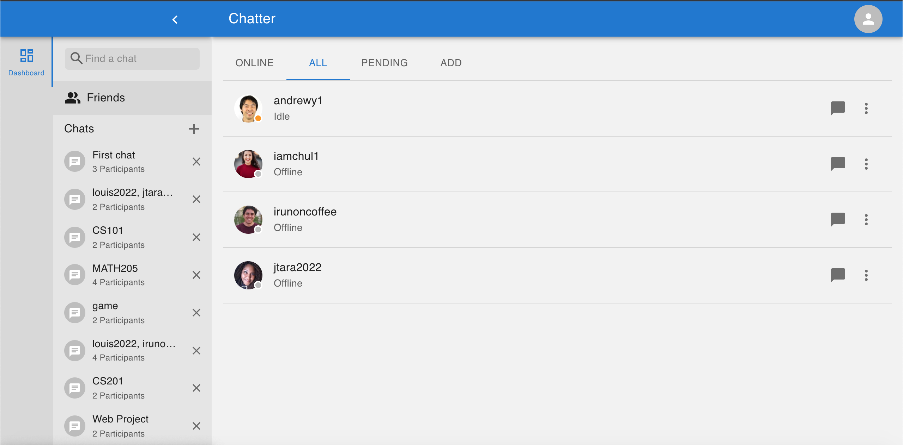
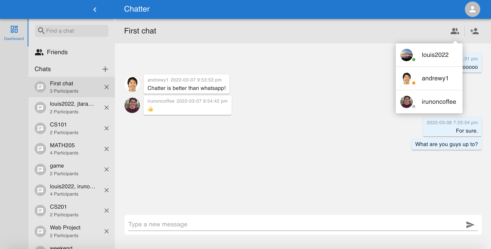
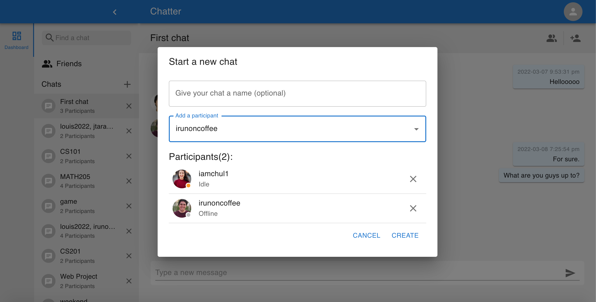
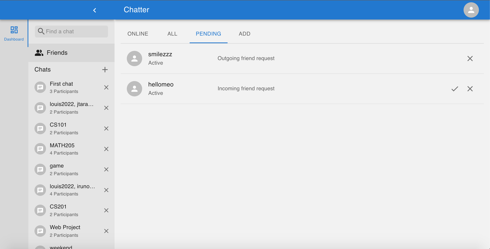
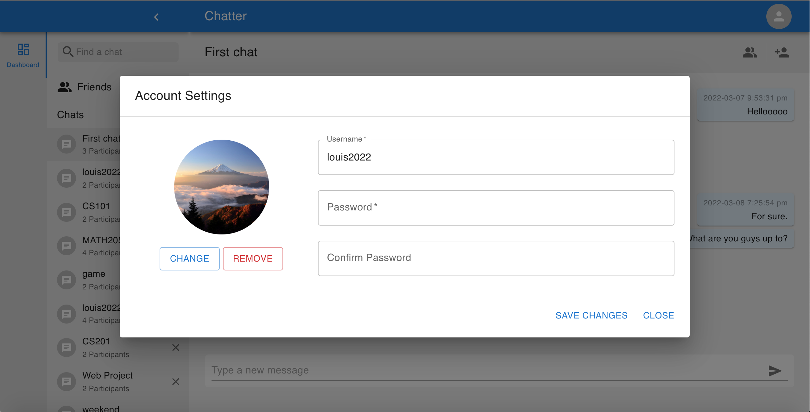

# Chatter (Real-time chat application)

(React/Node/Express/MongoDB)

Chatter is a mobile friendly chat application. Users can create an account, add friends, and chat with them.

## [DEMO](https://louis-chatter-app.herokuapp.com/)

**My goals for the project:**

* Learn and develop an application using a JavaScript web-socket library (Socket.IO)
* Practice using React Hooks
* Learn and use MongoDB
* Learn and use a new UI library (MUI)

## Screenshots:

* Friends

* Chat

* Start A New Chat

* Friend Requests

* Account Settings

## Notable Libraries Used

* [MUI for styling](https://mui.com/)
* [Formik for building forms](https://formik.org/)
* [Multer for file upload](https://www.npmjs.com/package/multer)
* [Jsonwebtoken for authentication](https://www.npmjs.com/package/jsonwebtoken)
* [Express-validator for backend validation](https://www.npmjs.com/package/express-validator)
* [Axios for communication](https://www.npmjs.com/package/axios)
* [Mongoose for connecting to MongoDB](https://mongoosejs.com/)
* [Socket.IO for managing user connections and sending real-time events](https://socket.io/)

## Todo/In-progress

* Add chat message reactions